# Architecture Diagrams — Booking Platform

High Level Design (HLD), Data Flow Diagrams (DFD), and supporting views for the Booking Platform on AWS.

**Related:** [devsecops-aws-deployment.md](./devsecops-aws-deployment.md) · [database-aws-rds.md](./database-aws-rds.md)

> **Note:** “HDL” in common usage means **HLD (High Level Design)** — used throughout this document.

---

## Diagram index

| # | Diagram | Type | Purpose |
|---|---------|------|---------|
| 1 | [System context](#1-hld--system-context) | HLD | External actors and system boundary |
| 2 | [AWS infrastructure](#2-hld--aws-infrastructure) | HLD | Production cloud topology |
| 3 | [Application layers](#3-hld--application-layers) | HLD | Next.js internal structure |
| 4 | [Component diagram](#4-hld--component-diagram) | HLD | Major modules and dependencies |
| 5 | [Security architecture](#5-hld--security-architecture) | HLD | Auth, secrets, scanning, network controls |
| 6 | [CI/CD pipeline](#6-hld--cicd-pipeline) | HLD | Build, scan, deploy flow |
| 7 | [VPC network](#7-hld--vpc-network) | HLD | Subnets and security groups |
| 8 | [DFD Level 0](#8-dfd--level-0-context) | DFD | Context diagram |
| 9 | [DFD Level 1](#9-dfd--level-1-system-decomposition) | DFD | Top-level processes |
| 10 | [DFD Level 2 — Auth](#10-dfd--level-2-authentication) | DFD | Sign-in / session flow |
| 11 | [DFD Level 2 — Booking](#11-dfd--level-2-booking) | DFD | Provider + portal booking |
| 12 | [DFD Level 2 — Reminders](#12-dfd--level-2-session-reminders) | DFD | Cron + email |
| 13 | [Logical data model](#13-logical-data-model-erd) | ERD | Core entities |
| 14 | [Sequence — Cognito sign-in](#14-sequence--cognito-sign-in) | Sequence | OAuth flow |
| 15 | [Sequence — Client self-book](#15-sequence--client-self-book) | Sequence | Portal booking |

---

## Legend

### DFD notation (used in Sections 8–12)

| Symbol | Meaning |
|--------|---------|
| `[External Entity]` | Person or system outside the app |
| `((Process))` | Transform / business logic |
| `[(Data Store)]` | Persistent data |
| `-->` | Data flow (label on arrow) |

### AWS / HLD notation

| Symbol | Meaning |
|--------|---------|
| Solid box | AWS managed service or app tier |
| Dashed box | Optional / external integration |
| Red path | Sensitive data (credentials, PII, tokens) |

---

## 1. HLD — System context

Shows the Booking Platform as a single system and its external dependencies.

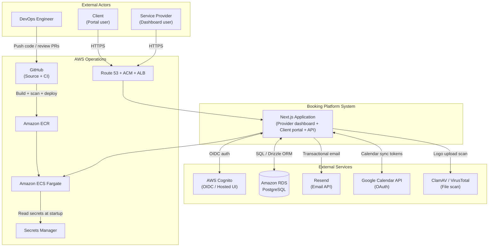

---

## 2. HLD — AWS infrastructure

Production reference architecture (ECS Fargate path from [devsecops-aws-deployment.md](./devsecops-aws-deployment.md)).

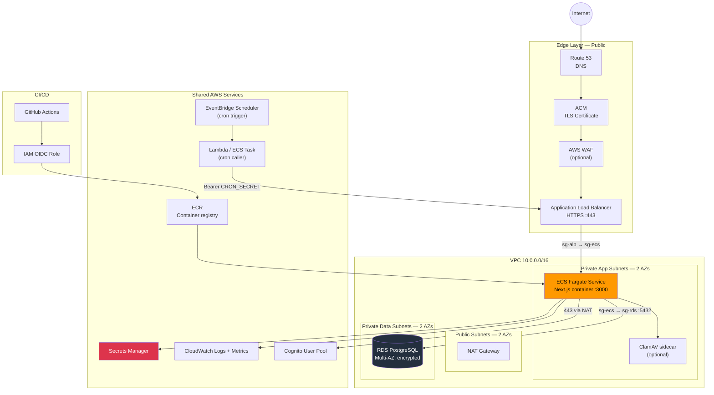

---

## 3. HLD — Application layers

Internal structure of the Next.js monolith.

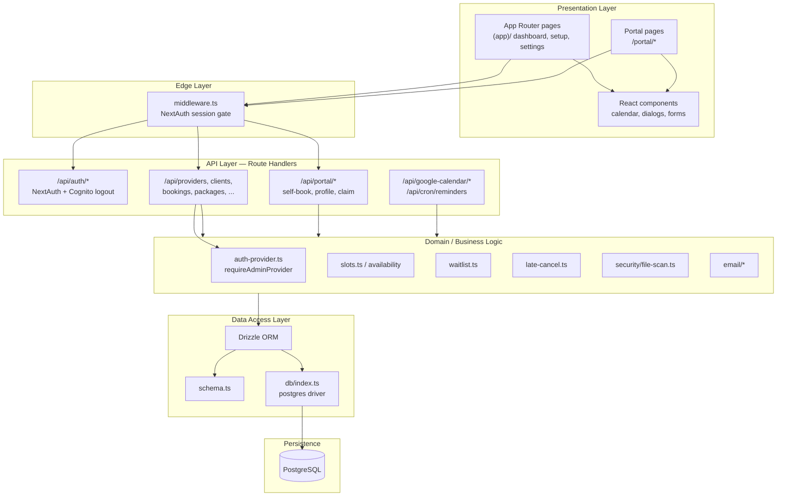

---

## 4. HLD — Component diagram

Functional modules and their main interactions.

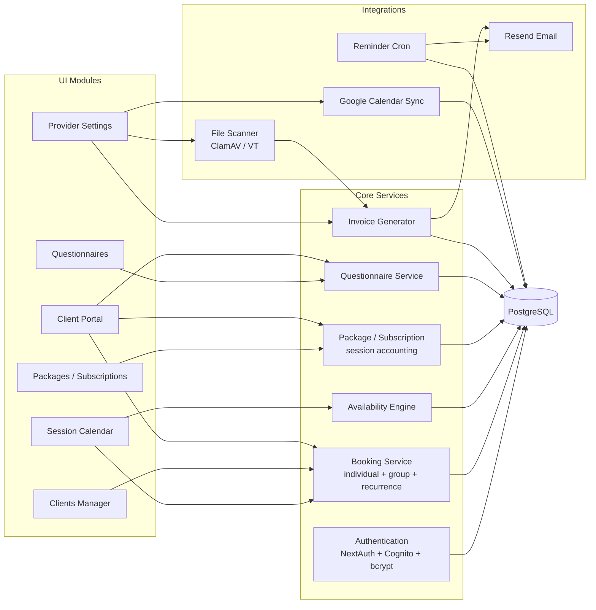

---

## 5. HLD — Security architecture

Defense-in-depth view aligned with [SECURITY.md](../SECURITY.md).

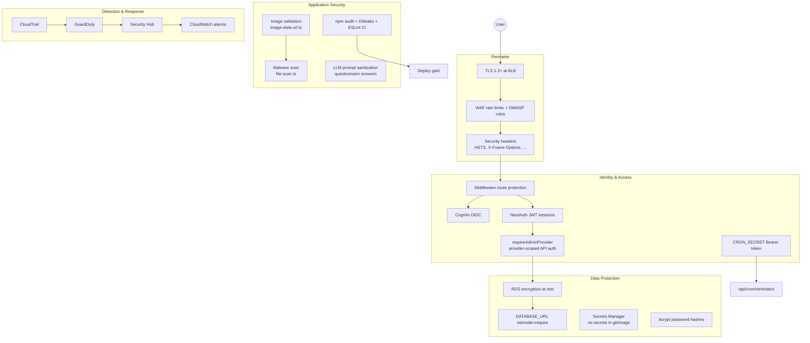

---

## 6. HLD — CI/CD pipeline

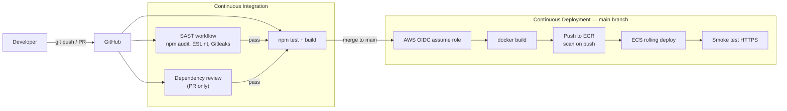

---

## 7. HLD — VPC network

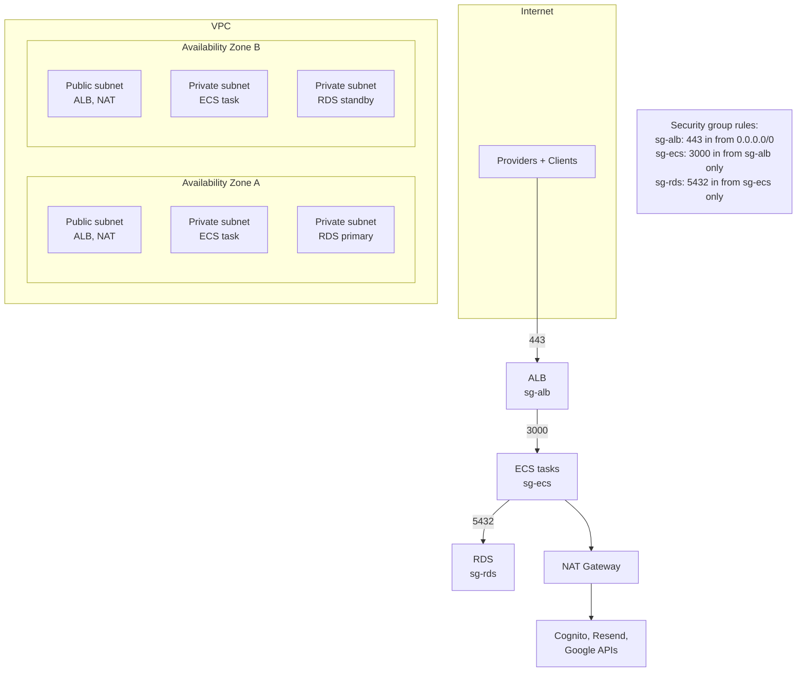

---

## 8. DFD — Level 0 (Context)

Single process representing the entire system. External entities exchange data with **P0: Booking Platform**.

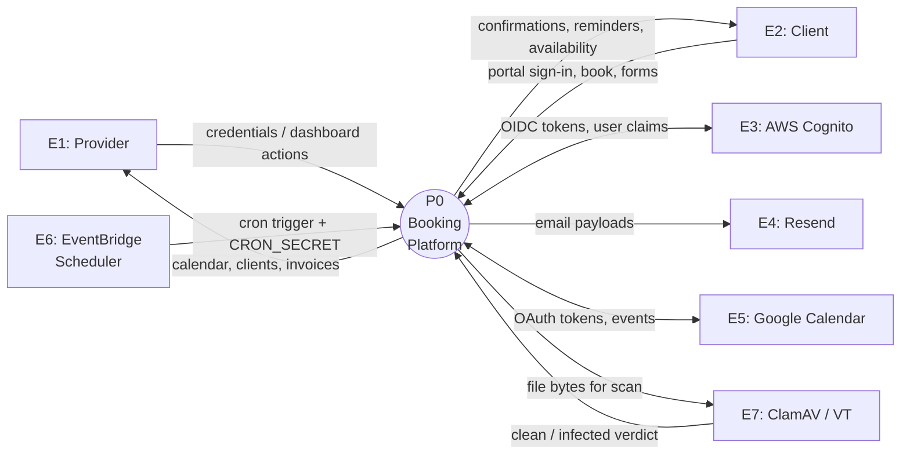

---

## 9. DFD — Level 1 (System decomposition)

P0 decomposed into major processes and data stores.

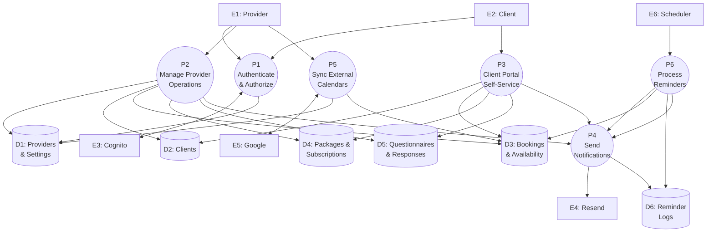

### Level 1 process descriptions

| Process | Description | Key API routes |
|---------|-------------|----------------|
| **P1** | Sign-in (Cognito OIDC or credentials), JWT session, middleware | `/api/auth/*`, `middleware.ts` |
| **P2** | Provider dashboard: clients, calendar, packages, questionnaires, settings | `/api/clients`, `/api/bookings`, `/api/packages`, … |
| **P3** | Client portal: book sessions, claim packages, complete forms | `/api/portal/*` |
| **P4** | Email: invoices, waitlist, reminders | Resend via `src/lib/email/*` |
| **P5** | Google Calendar OAuth connect/sync | `/api/google-calendar/*` |
| **P6** | Scheduled reminder job | `/api/cron/reminders` |

---

## 10. DFD — Level 2: Authentication

Decomposition of **P1 — Authenticate & Authorize**.

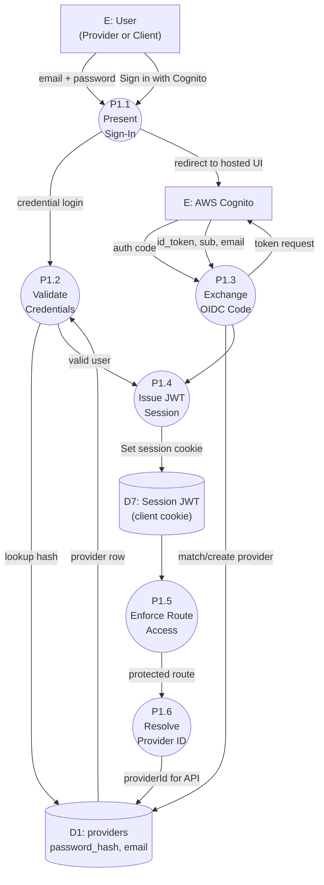

---

## 11. DFD — Level 2: Booking

Decomposition of booking flows for **P2** (provider) and **P3** (portal).

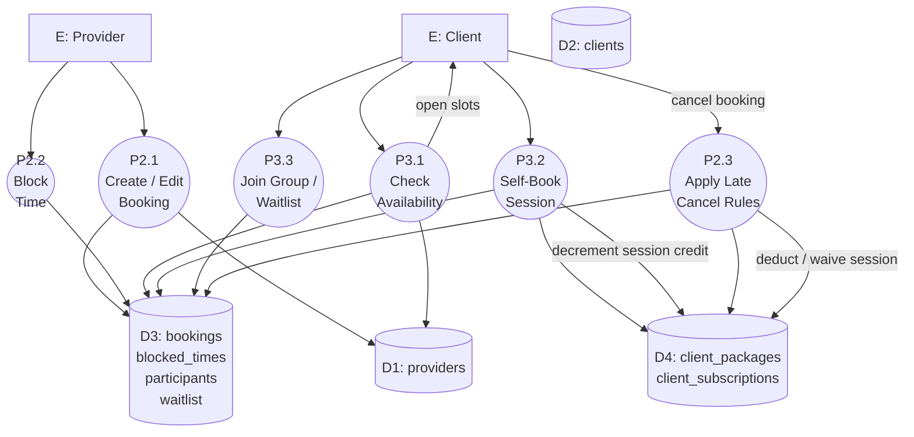

---

## 12. DFD — Level 2: Session reminders

Decomposition of **P6 — Process Reminders**.

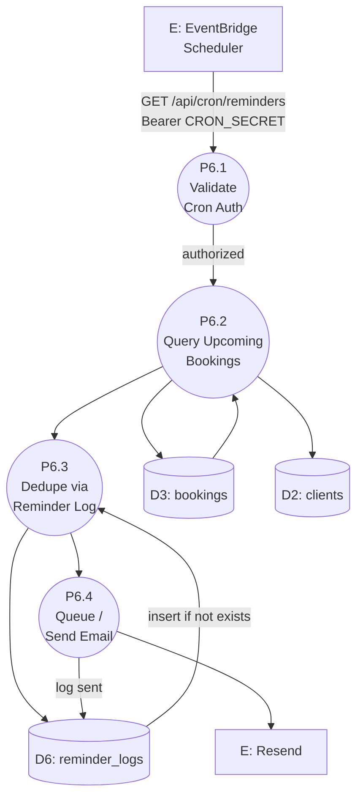

---

## 13. Logical data model (ERD)

Core entities from `src/lib/db/schema.ts` (simplified).

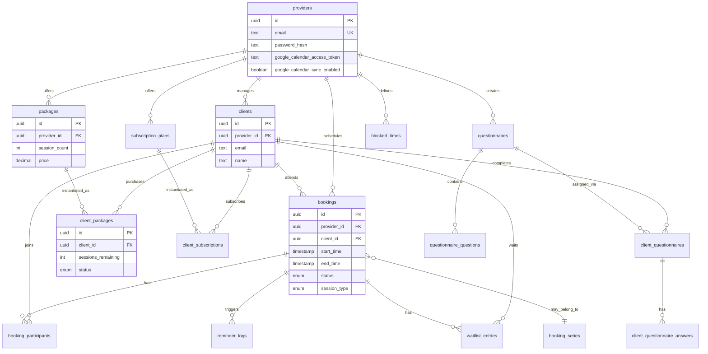

---

## 14. Sequence — Cognito sign-in

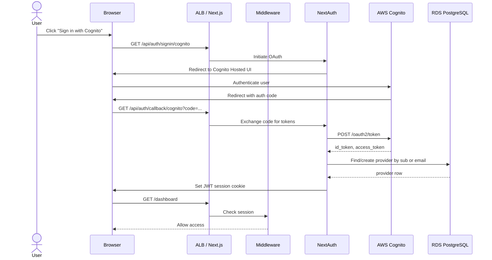

---

## 15. Sequence — Client self-book

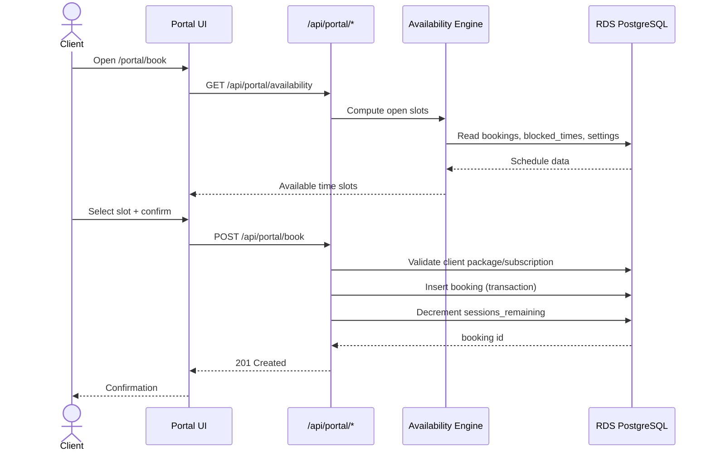

---

## Exporting diagrams

These diagrams use [Mermaid](https://mermaid.js.org/). To export as PNG/SVG/PDF:

1. **GitHub** — push this file; Mermaid renders in the repo UI.
2. **VS Code / Cursor** — Markdown Preview Mermaid Support extension.
3. **CLI** — `@mermaid-js/mermaid-cli`:
   ```bash
   npx @mermaid-js/mermaid-cli -i docs/architecture-diagrams.md -o docs/diagrams/
   ```
4. **Draw.io / Lucidchart** — import Mermaid or recreate for formal deliverables.

For architecture review packs, recommended exports:

| Deliverable | Sections to include |
|-------------|---------------------|
| Executive summary | 1, 2, 8 |
| Security review | 5, 7, 10 |
| Developer onboarding | 3, 4, 13 |
| Ops / runbook | 2, 6, 7, 12 |

---

## Document history

| Version | Date | Changes |
|---------|------|---------|
| 1.0 | 2026-06-05 | Initial HLD + DFD (L0–L2) + ERD + sequences |
