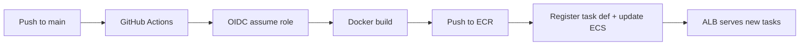

# Terraform — Booking Platform on AWS

Infrastructure as code matching the live deployment:

```
Internet → ALB (HTTPS) → ECS Fargate :3000 → RDS PostgreSQL (private)
                ↑
         ACM cert (booking.gindri.com)
         Secrets Manager (DATABASE_URL, AUTH_*, Cognito, Resend)
         ECR ← GitHub Actions (OIDC)
```

## What Terraform creates

| Resource | Name pattern | Notes |
|----------|--------------|-------|
| Security groups | `booking-platform-alb-sg`, `-ecs-sg`, `-rds-sg` | Three-tier model from README |
| ECR | `booking-platform` | Scan on push |
| ALB + target group | `booking-platform-alb`, `booking-platform-tg` | HTTP→HTTPS redirect, forward :3000 |
| ACM certificate | `booking.gindri.com` | DNS validation (GoDaddy CNAME) |
| ECS cluster/service | `booking-platform` | Fargate, linked to ALB |
| RDS PostgreSQL | `booking-platform-db` | Optional (`create_rds`) |
| Secrets Manager | `booking-platform/prod/*` | Auth, DB, Cognito, integrations |
| IAM | ECS execution/task roles, GitHub deploy role | OIDC — no long-lived AWS keys |

**Not managed by Terraform:** Cognito User Pool (configure values in Secrets Manager), GoDaddy DNS records.

## Prerequisites

- [Terraform](https://www.terraform.io/downloads) ≥ 1.5
- AWS CLI configured (`aws configure`)
- IAM permissions to create VPC, ECS, RDS, ALB, IAM roles

## Quick start (new environment)

```bash
cd terraform
cp terraform.tfvars.example terraform.tfvars
# Edit terraform.tfvars (domain, GitHub repo, create_rds, etc.)

terraform init
terraform plan
terraform apply
```

After the first `apply`:

1. **ACM validation** — run `terraform output acm_dns_validation_records` and add the CNAME in GoDaddy.
2. **App DNS** — CNAME `booking` → `terraform output -raw alb_dns_name`.
3. **Secrets** — in AWS Console → Secrets Manager, set Cognito keys in `booking-platform/prod/cognito` (and optional Resend key).
4. **Database schema** — from a machine that can reach RDS (or one-off ECS task):

   ```bash
   export DATABASE_URL="..."  # from Secrets Manager
   npx drizzle-kit push
   ```

5. **GitHub Actions** — set repository **Variables** (Settings → Secrets and variables → Actions → Variables):

   | Variable | Value |
   |----------|--------|
   | `AWS_DEPLOY_ROLE_ARN` | `terraform output -raw github_deploy_role_arn` |
   | `AWS_REGION` | `us-east-1` |
   | `APP_URL` | `https://booking.gindri.com` |
   | `ECR_REPOSITORY` | `booking-platform` |
   | `ECS_CLUSTER` | `booking-platform` |
   | `ECS_SERVICE` | `booking-platform` |
   | `ECS_TASK_FAMILY` | `booking-platform` |

6. Push to `main` — [`.github/workflows/deploy-aws.yml`](../.github/workflows/deploy-aws.yml) builds, pushes to ECR, and rolls ECS.

## Existing manual infrastructure

If you already created resources in the console (account `631026310596`, default VPC), choose one path:

### A — Import into Terraform (keep existing resources)

```bash
terraform import aws_ecr_repository.app booking-platform
terraform import aws_lb.app arn:aws:elasticloadbalancing:us-east-1:631026310596:loadbalancer/app/booking-platform-alb/...
# ... import security groups, target group, ECS service, etc.
```

Use `terraform plan` after each import until drift is minimal. Set `create_rds = false` and point `DATABASE_URL` in Secrets Manager at your existing RDS endpoint.

### B — Greenfield with Terraform (new stack)

Use a different `project_name` or AWS account to avoid name clashes, then cut over DNS when ready.

### GitHub OIDC provider already exists

If `terraform apply` fails creating the OIDC provider:

```hcl
create_github_oidc_provider = false
github_oidc_provider_arn      = "arn:aws:iam::631026310596:oidc-provider/token.actions.githubusercontent.com"
```

## Remote state (recommended for teams)

Uncomment the `backend "s3"` block in `versions.tf`, create:

- S3 bucket `booking-platform-terraform-state` (versioning + encryption)
- DynamoDB table `booking-platform-terraform-locks` (partition key `LockID`)

Then `terraform init -migrate-state`.

## CI/CD flow



Deploy runs **after** you configure `AWS_DEPLOY_ROLE_ARN`. SAST workflows (`sast.yml`) still run on PRs; add `deploy-aws` as a required check on `main` when ready.

## Variables reference

See [`variables.tf`](variables.tf) and [`terraform.tfvars.example`](terraform.tfvars.example).

Key flags:

| Variable | Default | Purpose |
|----------|---------|---------|
| `use_default_vpc` | `true` | Matches current default-VPC setup |
| `create_rds` | `true` | Set `false` if RDS already exists |
| `container_port` | `3000` | Must match Dockerfile / target group |
| `app_url` | `https://booking.gindri.com` | ECS env + Docker build arg in CI |

## Troubleshooting

| Issue | Fix |
|-------|-----|
| ACM validation timeout | Add GoDaddy CNAME from `acm_dns_validation_records`, wait, re-apply |
| ECS tasks unhealthy | Target group port must be **3000**; check security groups |
| Sign-in fails after deploy | `AUTH_URL` / `APP_URL` must match browser HTTPS origin |
| OIDC deploy denied | Trust policy branch must match (`refs/heads/main`) |
| `create_github_oidc_provider` conflict | Provider already exists — set `false` and pass ARN |

## Related docs

- [docs/devsecops-aws-deployment.md](../docs/devsecops-aws-deployment.md)
- [README.md](../README.md) — network & troubleshooting section
- [scripts/push-ecr.ps1](../scripts/push-ecr.ps1) — manual image push
- [scripts/ecs-deploy.sh](../scripts/ecs-deploy.sh) — deploy script used by GitHub Actions
